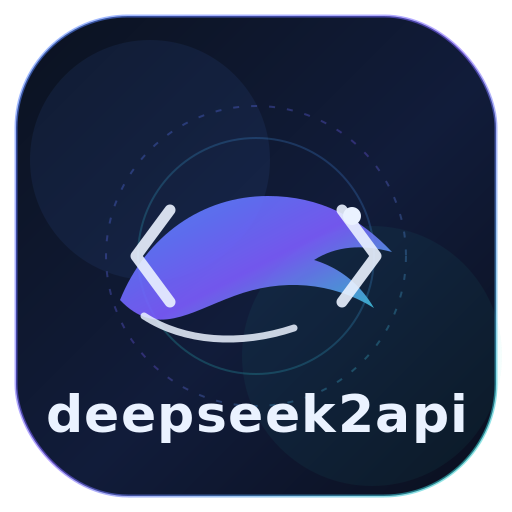

<div align="center">
  

  <h1>deepseek2api</h1>

  <p><strong>Ubah <a href="https://chat.deepseek.com">chat.deepseek.com</a> menjadi API kompatibel OpenAI.</strong><br/>
  Proxy Go ringan tanpa dependensi yang berbicara protokol OpenAI Chat Completions.</p>

  <p>
    <a href="https://github.com/0xgetz/deepseek2api/stargazers"></a>
    <a href="https://github.com/0xgetz/deepseek2api/network/members"></a>
    <a href="LICENSE"></a>
  </p>
  <p>
    
    
    
  </p>
  <p>
    <a href="README.md"></a>
    <a href="README.id.md"></a>
    <a href="README.zh.md"></a>
    <a href="README.ja.md"></a>
    <a href="README.es.md"></a>
  </p>
</div>

---

## Apa ini?

`deepseek2api` membungkus **aplikasi web chat.deepseek.com** di balik API HTTP
yang bersih dan kompatibel dengan OpenAI. Ditulis dengan Go murni hanya memakai
pustaka standar, sehingga menjadi satu binary statis tanpa dependensi runtime.

Arahkan klien OpenAI apa pun ke sini — Cherry Studio, LobeChat, Open WebUI, SDK
resmi OpenAI, `curl` — dan bicaralah dengan DeepSeek tanpa API key resmi.

> **Bawa akunmu sendiri.** Kamu menyediakan `userToken` web dari sesi peramban
> yang sudah login. Proxy tidak mengirim data ke mana pun.

## Fitur

- **Kompatibel OpenAI Chat Completions** — `POST /v1/chat/completions`, streaming dan non-streaming.
- **Daftar model** — `GET /v1/models`.
- **Masukan gambar** — blok `image_url` menerima data URL base64 dan tautan http(s); gambar diunggah ke DeepSeek dan dikirim sebagai `ref_file_ids`.
- **Proof-of-work otomatis** — server menyelesaikan tantangan DeepSeekHashV1 (varian Keccak 23 putaran) secara paralel, biasanya di bawah 100 ms.
- **Dukungan penalaran** — keluaran thinking dipetakan ke `reasoning_content`, sama seperti API resmi DeepSeek.
- **Kumpulan token multi-akun** — rotasi bergilir; token tetap di sisi server.
- **Konteks multi-putaran** — cache prefiks otomatis memakai ulang sesi DeepSeek; juga mendukung passthrough `conversation_id`.
- **Nama model tahan masa depan** — id `deepseek-*` tak dikenal dipetakan secara heuristik (kata kunci reasoner/think/search).
- **Membersihkan diri** — sesi menganggur dihapus di sisi upstream agar daftar chat tetap rapi.
- **Siap Docker / Docker Compose.**

## Model yang didukung

| ID Model | Perilaku web | Alias |
| --- | --- | --- |
| `deepseek-chat` | Mode cepat | `deepseek-v3` |
| `deepseek-reasoner` | Mode cepat + pemikiran mendalam | `deepseek-r1` |
| `deepseek-search` | Mode cepat + pencarian web | |
| `deepseek-reasoner-search` | Pemikiran mendalam + pencarian web | |

## Mendapatkan token

1. Masuk ke [chat.deepseek.com](https://chat.deepseek.com) di peramban.
2. Buka DevTools (F12) → Console dan jalankan:

   ```js
   JSON.parse(localStorage.userToken).value
   ```

3. Salin keluarannya. Token tetap valid sampai kamu logout; ulangi untuk akun tambahan.

## Mulai cepat

### Build

```bash
go build -o deepseek2api .
```

### Jalankan

Satu akun:

```bash
PROXY_API_KEY='kunci-proxy-mu' DEEPSEEK_TOKEN='token-mu' PORT=8080 ./deepseek2api
```

Banyak akun: buat `accounts.txt` di direktori kerja, satu token per baris (baris
kosong dan komentar `#` diabaikan):

```text
eyJhbGciOi...token1
eyJhbGciOi...token2
```

```bash
PROXY_API_KEY='kunci-proxy-mu' ./deepseek2api
```

### Uji

```bash
curl http://127.0.0.1:8080/v1/chat/completions \
  -H 'Authorization: Bearer kunci-proxy-mu' \
  -H 'Content-Type: application/json' \
  -d '{
    "model": "deepseek-reasoner",
    "messages": [{"role": "user", "content": "Halo"}],
    "stream": true
  }'
```

## Docker

```bash
docker build -t deepseek2api .

docker run --rm -p 8080:8080 \
  -e PROXY_API_KEY='kunci-proxy-mu' \
  -e DEEPSEEK_TOKEN='token-mu' \
  deepseek2api
```

Atau dengan Compose:

```bash
PROXY_API_KEY='kunci-proxy-mu' DEEPSEEK_TOKEN='token-mu' docker compose up --build
```

## Konfigurasi

| Variabel | Default | Keterangan |
| --- | --- | --- |
| `PORT` | `8080` | Port HTTP lokal |
| `PROXY_API_KEY` | tidak ada — wajib | Kunci yang dipakai klien untuk memanggil proxy |
| `DEEPSEEK_TOKEN` | kosong | `userToken` web DeepSeek |
| `DEEPSEEK_ACCOUNTS_FILE` | `accounts.txt` | Berkas multi-akun, satu token per baris |
| `DEEPSEEK_BASE_URL` | `https://chat.deepseek.com` | URL dasar upstream |
| `DEFAULT_MODEL` | `deepseek-chat` | Model bila permintaan tidak menyebutkannya |
| `CONVERSATION_TTL` | `30m` | Waktu menganggur sebelum sesi dihapus di upstream |
| `MAX_CONVERSATIONS` | `1024` | Maksimum sesi di memori (eviksi LRU) |

## Percakapan multi-putaran

- **Mode otomatis (disarankan).** Klien mengirim array `messages` penuh seperti
  biasa. Proxy membuat sidik jari riwayat (semua kecuali pesan terakhir); bila
  cocok, sesi DeepSeek yang sama dipakai ulang dan hanya putaran baru yang
  dikirim, jika tidak dibuat sesi baru. Klien populer bekerja tanpa perubahan.
- **Mode passthrough.** Respons memuat bidang non-standar `conversation_id` (id
  sesi DeepSeek). Kirimkan di body permintaan berikutnya untuk memakai ulang
  sesi; hanya pesan user terakhir yang dipakai sebagai prompt.

> Catatan cold start: setelah restart, jika riwayat lebih dari satu putaran,
> hanya system prompt dan pesan user terbaru yang dikirim ulang.

## Autentikasi

Setiap permintaan `/v1/*` memerlukan:

```http
Authorization: Bearer <PROXY_API_KEY>
```

`DEEPSEEK_TOKEN` / `accounts.txt` hanya dipakai di sisi server dan tidak pernah
dibuka ke pemanggil.

## Catatan & batasan

- **Gambar:** ≤ 20 MB masing-masing, maksimal 8 per permintaan, png/jpg/webp/gif/bmp. Hanya gambar pada pesan user terakhir yang diproses.
- **Usage** bersifat estimasi: total berasal dari selisih token kumulatif sesi upstream, dan pembagiannya didekati dengan jumlah karakter.
- `429` upstream dipetakan ke `429`; token tidak valid dipetakan ke `401`.
- Jangan pernah commit tokenmu. `accounts.txt` sudah ada di `.gitignore`.

## Struktur proyek

```
main.go                 server HTTP dan routing
config/                 konfigurasi lingkungan
handlers/               handler kompatibel OpenAI, SSE, unggah gambar
deepseek/               klien upstream, proof-of-work, streaming
docs/api-analysis.md    catatan rekayasa balik API upstream
assets/                 logo dan banner
```

## Lisensi

Dirilis di bawah [Lisensi MIT](LICENSE).

<div align="center"><sub>Tidak berafiliasi dengan DeepSeek. Gunakan dengan bijak dan hormati ketentuan upstream.</sub></div>
